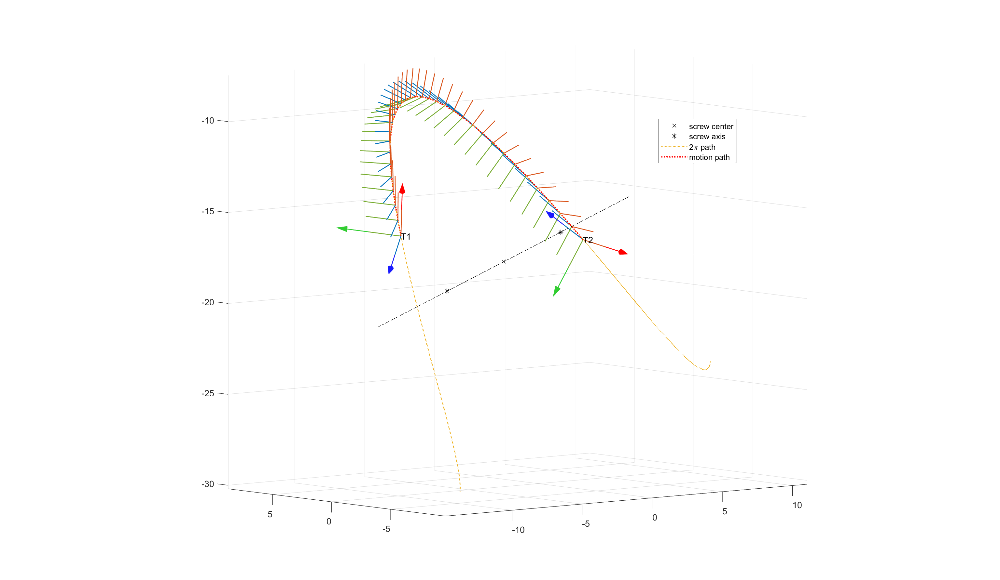

# Screw-Motion-Plot-Data
 Visualize Homogeneous Transformation as Screw Motion


Common Knowledge: 

- Rotation == Axis Angle
- Homogeneous Transformation == Screw Motion


This Function helps you view the Screw Motion:



Can Be used in education, debugging, or show off in a group project.


```matlab
plotdata = GetScrewPlotData(T1,T2,min_ag,axis_length)
```


**Input:**

- T1, T2: 4*4 SE3 Matrix
- min_ag: 1*2 array, min_ag(1) is min step from T1 to T2; min_ag(2) is min
- step for 360 deg path
- axis_length: axis length scale, 1 is the same length as the screw pitch


**Output:** 

- plotdata.ProjPt: screw motion path head and tail project on screw axis
- plotdata.Center: screw center
- plotdata.Frames: intermediate frames from T1 to T2
- plotdata.Path: path from T1 to T2
- plotdata.FPath: full 360 deg revolution path
- plotdata.Axis: screw axis
- plotdata.Pitch: pitch, 1/rad
- plotdata.Angle: screw rotate angle


You can plot the frame and screw motion path use PlotFrame function (also included). For detail check:

<u>demo_GetScrewPlotData.mlx</u>
